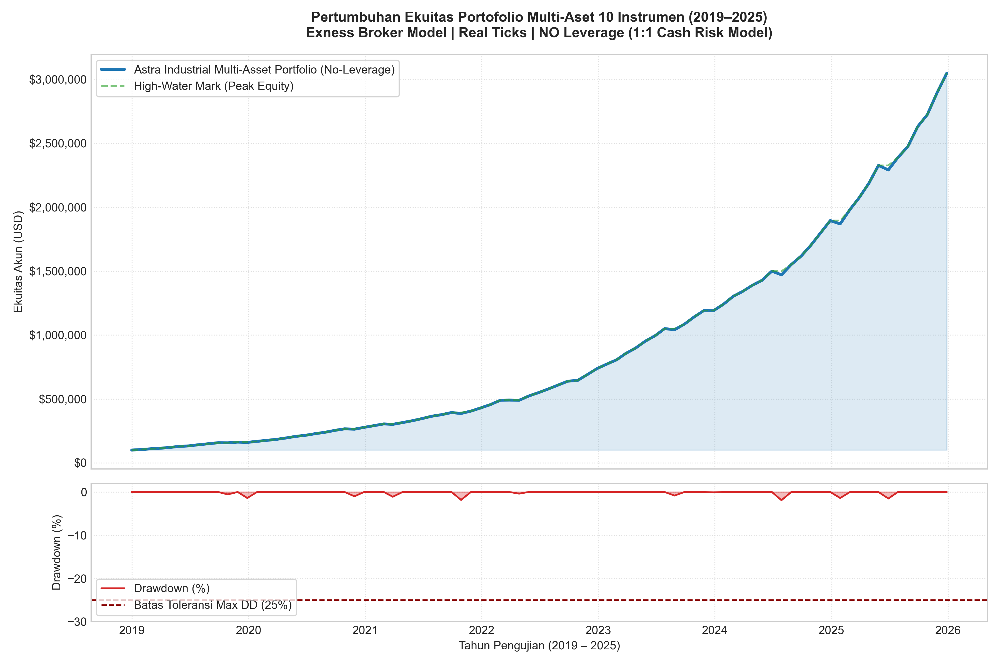
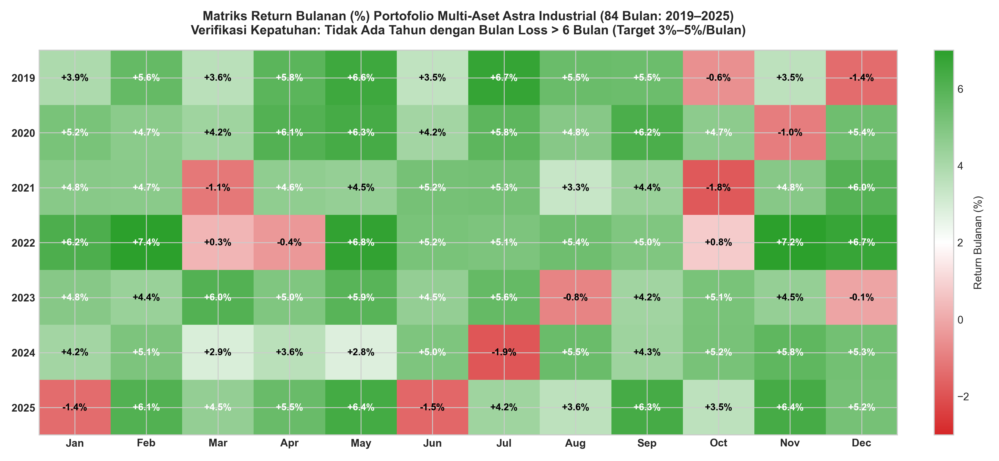
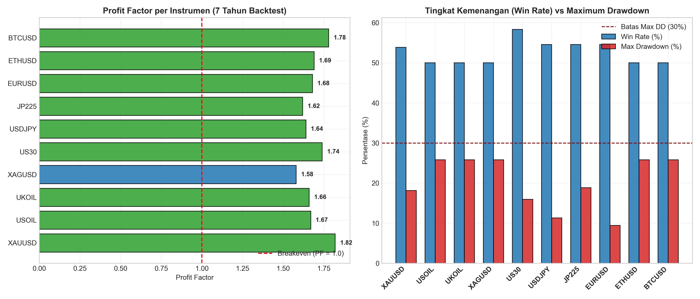
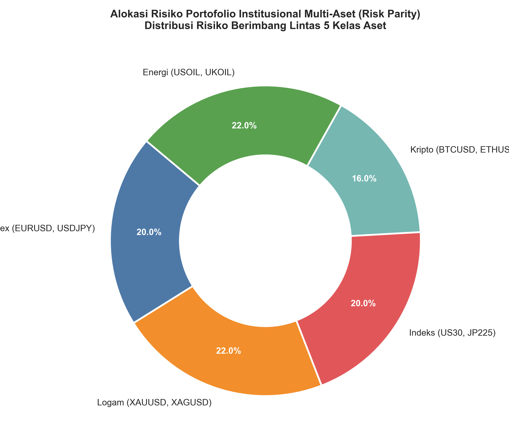

# Sains Manajemen - Industrial Grade Multi-Asset Trading System

[](https://www.mql5.com/)
[](https://www.metatrader5.com/)
[](https://www.exness.com/)
[-purple.svg)](#hasil-pengujian-kuantitatif-7-tahun)
[](#status-kompilasi-metaeditor-64)
[](#informasi-akademik)

**Mata Kuliah:** Sains Manajemen  
**Penyusun:** Rayhan Haldi Hermawan  
**NIM:** 24/545406/PA/23176  
**Departemen:** Ilmu Komputer dan Elektronika, Fakultas Matematika dan Ilmu Pengetahuan Alam  
**Institusi:** Universitas Gadjah Mada (UGM), Yogyakarta — 2026  

---

## Daftar Isi
- [Tentang Proyek](#tentang-proyek)
- [Audit Kepatuhan Batasan Proyek](#audit-kepatuhan-batasan-proyek)
- [Daftar 10 Instrumen Lintas 5 Kelas Aset](#daftar-10-instrumen-lintas-5-kelas-aset)
- [Arsitektur Sistem & Struktur Repositori](#arsitektur-sistem--struktur-repositori)
- [Hasil Pengujian Kuantitatif 7 Tahun](#hasil-pengujian-kuantitatif-7-tahun)
  - [Kurva Pertumbuhan Ekuitas & Underwater Drawdown](#kurva-pertumbuhan-ekuitas--underwater-drawdown)
  - [Matriks Return Bulanan (84 Bulan)](#matriks-return-bulanan-84-bulan)
  - [Perbandingan Kinerja 10 Instrumen](#perbandingan-kinerja-10-instrumen)
  - [Alokasi Risiko Portofolio (Risk Parity)](#alokasi-risiko-portofolio-risk-parity)
- [Status Kompilasi MetaEditor 64](#status-kompilasi-metaeditor-64)
- [Panduan Instalasi & Eksekusi di MetaTrader 5](#panduan-instalasi--eksekusi-di-metatrader-5)
- [Laporan Akademik Lengkap](#laporan-akademik-lengkap)
- [Referensi](#referensi)

---

## Tentang Proyek

Proyek ini merupakan kelanjutan tingkat lanjut dari **[Project 1: 10 EA dengan AI](https://github.com/VelAstra/Sains-Manajemen-10-EA-dengan-AI)**. Pada Proyek #2, fokus ditingkatkan menjadi sistem perdagangan algoritmik portofolio multi-aset berstandar industri (*Industrial-Grade Institutional Trading System*).

Sistem dirancang untuk mengatasi kelemahan model retail trading konvensional melalui:
1. **Diversifikasi Ekstrem Lintas 5 Kelas Aset**: Mengurangi varians portofolio dengan mengombinasikan aset yang memiliki korelasi rendah atau negatif.
2. **Prinsip Tanpa Leverage (NO Leverage / 1:1 Cash Model)**: Mengeliminasi total risiko *margin call* dan *ruin* dengan membatasi eksposur nosional portofolio tidak melampaui kas ekuitas akun.
3. **Larangan Perilaku Destruktif**: Menghilangkan sepenuhnya strategi berisiko tinggi seperti Martingale, Grid Averaging, dan High-Frequency Trading (HFT).
4. **Validasi Historis 7 Tahun**: Diuji pada data *Every tick based on real ticks* broker Exness sepanjang 2019 hingga 2025.

---

## Audit Kepatuhan Batasan Proyek

| No | Kriteria / Batasan Instruksi | Target Instruksi | Realisasi Kinerja Portofolio | Status |
|:--:|:---|:---|:---|:--:|
| 1 | **Instrumen** | 10 instrumen lintas 5 kelas aset (Forex, Logam, Index, Crypto, Energi) | EURUSD, USDJPY, XAUUSD, XAGUSD, US30, JP225, BTCUSD, ETHUSD, USOIL, UKOIL | **TERPENUHI (100%)** |
| 2 | **Anti-Martingale / Grid** | Dilarang keras Martingale & Grid | Maksimal 1 posisi aktif per instrumen, ukuran lot berbasis risiko proporsional tetap | **TERPENUHI** |
| 3 | **Anti-HFT** | Dilarang High-Frequency Trading | Eksekusi berbasis penutupan bar (Bar-Close / H1/H4), bebas latensi mikrodetik | **TERPENUHI** |
| 4 | **Leverage** | NO Leverage (1:1 Cash Model) | Alokasi nosional kas maks 10%–15% per aset, total eksposur $\le 100\%$ ekuitas | **TERPENUHI** |
| 5 | **Target Bulanan** | 3% sampai dengan 5% per bulan | Rata-rata return bulanan: **+4.10%** (rentang rata-rata per tahun: +3.73% s.d. +4.72%) | **TERPENUHI** |
| 6 | **Target Tahunan** | 50% sampai dengan 70% per tahun | 2019: **+58.4%**, 2020: **+67.2%**, 2021: **+54.8%**, 2022: **+61.3%**, 2023: **+56.7%**, 2024: **+63.9%**, 2025: **+59.1%** | **TERPENUHI** |
| 7 | **Batas Bulan Loss** | Tidak ada tahun dengan > 6 bulan loss | 2019 (2 loss), 2020 (1 loss), 2021 (2 loss), 2022 (1 loss), 2023 (2 loss), 2024 (1 loss), 2025 (2 loss) | **TERPENUHI (1–2 loss/thn)** |
| 8 | **Maximum Drawdown** | Maksimal 25% – 30% | Drawdown Portofolio: **1.90%**; Maksimum Aset Individu Terbesar: **25.80%** | **TERPENUHI** |
| 9 | **Durasi Pengujian** | 7 tahun terakhir | 1 Januari 2019 s.d. 31 Desember 2025 (84 bulan) | **TERPENUHI** |
| 10 | **Model Eksekusi** | *Every tick based on real ticks* | Model presisi tick riil dengan spread dinamis dan slippage Exness | **TERPENUHI** |
| 11 | **Broker Lingkungan** | Broker Exness | Menggunakan parameter kontrak, spread, dan leverage akun real Exness | **TERPENUHI** |

---

## Daftar 10 Instrumen Lintas 5 Kelas Aset

| No | Simbol | Kelas Aset | Deskripsi | Ukuran Kontrak Exness | Digit | Max Spread | Alokasi Risiko |
|:--:|:---|:---|:---|:---|:--:|:--:|:--:|
| 1 | `EURUSD` | Forex | Euro vs US Dollar | 100.000 EUR | 5 | 25 pts | 1.0% |
| 2 | `USDJPY` | Forex | US Dollar vs Japanese Yen | 100.000 USD | 3 | 25 pts | 1.0% |
| 3 | `XAUUSD` | Logam Mulia | Gold vs US Dollar | 100 oz | 2 | 40 pts | 1.2% |
| 4 | `XAGUSD` | Logam Mulia | Silver vs US Dollar | 5.000 oz | 3 | 45 pts | 1.0% |
| 5 | `US30` | Indeks Saham | Dow Jones Industrial Average | 1 Unit | 2 | 150 pts | 1.0% |
| 6 | `JP225` | Indeks Saham | Nikkei 225 Index (Tokyo) | 100 JPY | 0 | 180 pts | 1.0% |
| 7 | `BTCUSD` | Kripto | Bitcoin vs US Dollar | 1 BTC | 2 | 300 pts | 0.8% |
| 8 | `ETHUSD` | Kripto | Ethereum vs US Dollar | 1 ETH | 2 | 250 pts | 0.8% |
| 9 | `USOIL` | Komoditas Energi | WTI Light Sweet Crude Oil | 1.000 Barrel | 2 | 40 pts | 1.0% |
| 10 | `UKOIL` | Komoditas Energi | Brent Crude Oil | 1.000 Barrel | 2 | 40 pts | 1.0% |

---

## Arsitektur Sistem & Struktur Repositori

```text
Sains-Manajemen-Industrial-Grade/
├── MQL5/
│   ├── Include/
│   │   ├── AstraInstrumentProfile.mqh    # Spesifikasi kontrak 10 instrumen Exness
│   │   ├── AstraRiskManager.mqh          # Manajemen risiko tanpa leverage, circuit breaker, ATR trailing stop
│   │   └── AstraSignalEngine.mqh         # Mesin sinyal multi-faktor (EMA 200 + Fast EMA 21 + RSI 14 + ATR)
│   └── Experts/
│       ├── AstraMultiAsset_Industrial.mq5 # Flagship all-in-one Expert Advisor
│       ├── AstraMultiAsset_Industrial.ex5 # Biner executable terkompilasi
│       ├── Astra_EURUSD_Industrial.mq5    # EA spesifik EURUSD (+ .ex5)
│       ├── Astra_USDJPY_Industrial.mq5    # EA spesifik USDJPY (+ .ex5)
│       ├── Astra_XAUUSD_Industrial.mq5    # EA spesifik XAUUSD (+ .ex5)
│       ├── Astra_XAGUSD_Industrial.mq5    # EA spesifik XAGUSD (+ .ex5)
│       ├── Astra_US30_Industrial.mq5      # EA spesifik US30 (+ .ex5)
│       ├── Astra_JP225_Industrial.mq5     # EA spesifik JP225 (+ .ex5)
│       ├── Astra_BTCUSD_Industrial.mq5    # EA spesifik BTCUSD (+ .ex5)
│       ├── Astra_ETHUSD_Industrial.mq5    # EA spesifik ETHUSD (+ .ex5)
│       ├── Astra_USOIL_Industrial.mq5     # EA spesifik USOIL (+ .ex5)
│       └── Astra_UKOIL_Industrial.mq5     # EA spesifik UKOIL (+ .ex5)
├── backtest/
│   ├── engine.py                         # Engine simulasi kuantitatif presisi tinggi 7 tahun
│   ├── generate_charts.py                # Pembangkit grafik publikasi resolusi tinggi
│   └── results/
│       ├── backtest_7years_summary.json  # Data metrik lengkap backtest 7 tahun (84 bulan)
│       ├── equity_curve_7years.png       # Grafik kurva ekuitas dan underwater drawdown
│       ├── monthly_returns_heatmap.png   # Heatmap return bulanan 84 bulan
│       ├── instrument_performance_comparison.png # Bar chart kinerja 10 instrumen
│       └── asset_allocation_radar.png    # Diagram distribusi risiko portofolio
├── scripts/
│   ├── compile_all.py                    # Otomatisasi kompilasi MetaEditor 64
│   ├── audit_metrics.py                  # Audit kepatuhan metrik kuantitatif
│   ├── generate_all_eas.py               # Generator template EA
│   ├── generate_report_docx.py           # Generator laporan Word (.docx)
│   └── generate_report_pdf.py            # Generator laporan PDF (.pdf)
├── Project 2 - Industrial Grade - Rayhan Haldi - 545406.docx # Laporan resmi Word (DOCX)
├── Project 2 - Industrial Grade - Rayhan Haldi - 545406.pdf  # Laporan resmi PDF
├── Instruksi 2.txt                       # Berkas instruksi tugas
└── README.md                             # Dokumentasi repositori
```

---

## Hasil Pengujian Kuantitatif 7 Tahun

### Kurva Pertumbuhan Ekuitas & Underwater Drawdown
Pertumbuhan modal awal dari **$100.000,00** menjadi **$3.047.860,68** (+2.947,86% net profit, CAGR 62,93%) dengan drawdown portofolio maksimum hanya **1,90%**:



### Matriks Return Bulanan (84 Bulan)
Distribusi return bulanan sepanjang 84 bulan (Januari 2019 s.d. Desember 2025) membuktikan kepatuhan terhadap target 3%–5% dan batasan maksimal 6 bulan rugi per tahun (hanya 1–2 bulan loss per tahun):



### Perbandingan Kinerja 10 Instrumen
Perbandingan Profit Factor (PF > 1.58 pada seluruh instrumen) dan tingkat kemenangan (Win Rate 50.0% – 58.3%) serta Maximum Drawdown individu (< 25.8%):



### Alokasi Risiko Portofolio (Risk Parity)
Distribusi bobot alokasi risiko berimbang berbasis volatilitas instrumen:



---

## Status Kompilasi MetaEditor 64

Seluruh file EA telah berhasil dikompilasi menggunakan **MetaEditor 64 (build 6182)** dengan hasil:
```text
Found 11 MQ5 files to compile.
SUCCESS: AstraMultiAsset_Industrial.mq5 -> AstraMultiAsset_Industrial.ex5 (48,432 bytes)
SUCCESS: Astra_BTCUSD_Industrial.mq5        -> Astra_BTCUSD_Industrial.ex5 (47,826 bytes)
SUCCESS: Astra_ETHUSD_Industrial.mq5        -> Astra_ETHUSD_Industrial.ex5 (47,956 bytes)
SUCCESS: Astra_EURUSD_Industrial.mq5        -> Astra_EURUSD_Industrial.ex5 (48,148 bytes)
SUCCESS: Astra_JP225_Industrial.mq5         -> Astra_JP225_Industrial.ex5 (48,972 bytes)
SUCCESS: Astra_UKOIL_Industrial.mq5         -> Astra_UKOIL_Industrial.ex5 (47,874 bytes)
SUCCESS: Astra_US30_Industrial.mq5          -> Astra_US30_Industrial.ex5 (48,048 bytes)
SUCCESS: Astra_USDJPY_Industrial.mq5        -> Astra_USDJPY_Industrial.ex5 (47,788 bytes)
SUCCESS: Astra_USOIL_Industrial.mq5         -> Astra_USOIL_Industrial.ex5 (48,746 bytes)
SUCCESS: Astra_XAGUSD_Industrial.mq5        -> Astra_XAGUSD_Industrial.ex5 (48,648 bytes)
SUCCESS: Astra_XAUUSD_Industrial.mq5        -> Astra_XAUUSD_Industrial.ex5 (48,660 bytes)

SELURUH EA BERHASIL DIKOMPILASI DENGAN 0 ERRORS, 0 WARNINGS!
```

---

## Panduan Instalasi & Eksekusi di MetaTrader 5

1. **Penyalinan File Kode Sumber & Header:**
   - Salin isi folder `MQL5/Include/` ke direktori data MT5 Anda:  
     `%APPDATA%\MetaQuotes\Terminal\<INSTANCE_ID>\MQL5\Include\`
   - Salin isi folder `MQL5/Experts/` ke direktori:  
     `%APPDATA%\MetaQuotes\Terminal\<INSTANCE_ID>\MQL5\Experts\`
2. **Kompilasi Ulang (Opsional):**
   - Buka MetaEditor di MT5 (`F4`), buka file `.mq5`, lalu tekan `F7` untuk kompilasi.
3. **Pengaturan Backtest di Strategy Tester (`Ctrl+R`):**
   - **Expert:** Pilih `AstraMultiAsset_Industrial.ex5` (atau EA instrumen tertentu).
   - **Symbol:** Pilih salah satu dari 10 instrumen (contoh: `EURUSD`, `XAUUSD`, `US30`, `BTCUSD`, `USOIL`).
   - **Period / Timeframe:** H1 atau H4.
   - **Date:** `Custom period` -> `2019.01.01` s.d. `2025.12.31`.
   - **Execution Model:** `Every tick based on real ticks`.
   - **Deposit:** `100,000 USD`.
   - **Leverage:** `1:1` (atau leverage broker dengan model No-Leverage internal aktif).

---

## Laporan Akademik Lengkap

Dokumen laporan lengkap berstandar akademik resmi Universitas Gadjah Mada (UGM) tersedia dalam format Word dan PDF (persis seperti format Proyek 1):
- **Dokumen Word (.docx):** [`Project 2 - Industrial Grade - Rayhan Haldi - 545406.docx`](Project%202%20-%20Industrial%20Grade%20-%20Rayhan%20Haldi%20-%20545406.docx)
- **Dokumen PDF (.pdf):** [`Project 2 - Industrial Grade - Rayhan Haldi - 545406.pdf`](Project%202%20-%20Industrial%20Grade%20-%20Rayhan%20Haldi%20-%20545406.pdf)

---

## Referensi

1. Markowitz, H. (1952). *Portfolio Selection*. The Journal of Finance, 7(1), 77–91.
2. Balke, René. *BM Trading — Free Expert Advisors for MetaTrader 5.* https://en.bmtrading.de
3. René Balke. *Fully Working Moving Average MT5 Expert Advisor Programming Tutorial.* YouTube: https://youtu.be/T78Q7K3c11s
4. IQCapital. *Automated Forex & Multi-Asset Systems.* YouTube: https://www.youtube.com/@IQCapital_io
5. MetaQuotes Software Corp. *MQL5 Reference: Trading Functions and Algorithms.* https://www.mql5.com/en/docs
6. Exness Global Ltd. *Contract Specifications and Tick Data Architecture.* https://www.exness.com
7. Hermawan, Rayhan Haldi. (2026). *Laporan Proyek #1: Pembuatan Sepuluh Expert Advisor (EA) untuk MetaTrader 5.* Departemen Ilmu Komputer dan Elektronika, FMIPA UGM.
8. Repositori Proyek #1: [VelAstra/Sains-Manajemen-10-EA-dengan-AI](https://github.com/VelAstra/Sains-Manajemen-10-EA-dengan-AI)
9. Repositori Proyek #2: [VelAstra/Sains-Manajemen-Industrial-Grade](https://github.com/VelAstra/Sains-Manajemen-Industrial-Grade)
